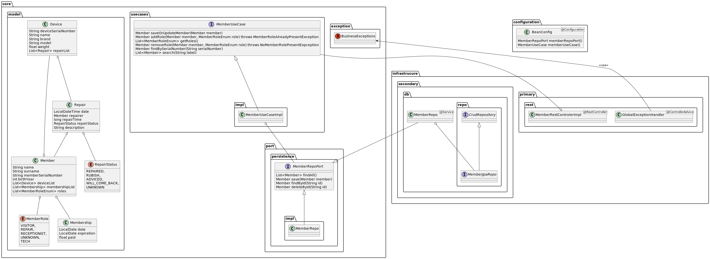

# repaircafe-hexagonal-springboot

Ce dépot contient le code source d'une application web de gestion de réparation d'appareils dans le cadre d'un repair café. 
L'application est développée en Java avec le framework Spring Boot et suit une architecture hexagonale.
Ce type d'architecture est très lourde pour ce type de besoin mais l'objectife est de découvrir et de comprendre les concepts de l'architecture hexagonale.

## Architecture hexagonale

L'architecture hexagonale est une architecture logicielle qui permet de découpler le code métier de l'infrastructure.
Elle est composée de trois couches principales :
- La couche métier : contient le code métier de l'application
- La couche d'infrastructure : contient le code qui permet de communiquer avec l'extérieur (base de données, API, ...).
- La couche d'application : contient le code qui permet de faire le lien entre la couche métier et la couche d'infrastructure.

## Diagrammme de classe

